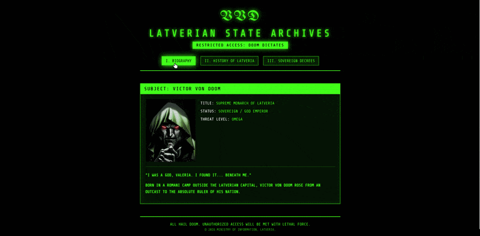

# 🛡️ Latverian State Archives | Doom OS


**The Latverian State Archives** is a brutalist, terminal-style web interface inspired by Marvel's Doctor Doom (Victor Von Doom). Operating as a classified government database, this project is built as a Single Page Application (SPA) using React.

To demonstrate architectural flexibility and deep understanding of the library, React and Babel are injected directly via CDN. This allows the application to run entirely strictly locally or on simple static hosting without the need for Node.js, npm, or any build tools.

## 🔮 Live Preview


---

## ⚙️ Technical Features & UI/UX

* **Zero-Build React Architecture:** Utilizes React 18 and Babel via CDN for immediate JSX rendering within a standard `index.html` file, bypassing complex Webpack/Vite setups.
* **SPA State Management:** Implements React's `useState` hook to manage tab navigation, allowing instant switching between database sections (Biography, History, Decrees) without page reloads.
* **Brutalist Terminal Aesthetic:** Features a custom CSS architecture utilizing toxic-green (`#39FF14`) text on an abyssal black background, simulating a high-security military monitor.
* **CRT Scanline Overlay:** A fixed, pointer-event-ignored CSS gradient overlay that creates a realistic retro-monitor scanline effect.
* **Custom WebKit Scrollbars:** Overrides default browser scrollbars with radioactive-green, glowing trackers to maintain total aesthetic immersion even when reading long documents (like the 50 Sovereign Decrees).

---

## 🚀 How to Run Locally

Since this project relies on CDN-injected React and pure web technologies, setup is instantaneous. No local server, package managers, or build steps are required.

1. **Clone this repository:**
```bash
git clone https://github.com/nickomega84/Latverian-OS.git
```

2. **Navigate to the project directory:**
```bash
cd "C:/Documents/Web Projects/Dr-Doom"
```

3. **Launch the OS:**
Simply locate and open the `index.html` file in your preferred modern web browser (Chrome, Firefox, Edge, etc.) to access the Latverian database.

---

## 📜 Project Structure

```text
/
├── assets/
│   ├── dr-doom.jpg        				# Target profile image
│   └── castle-doom.jpg    				# Location documentation
    └── assets/Flag_of_Latveria.svg    	# Icon flag
    └── assets/preview.gif    	        # Preview gif
├── index.html             				# Main semantic structure and React/JSX logic
├── style.css              				# Styling, terminal variables, and animations
└── README.md              				# Project documentation
```

---

## ⚖️ Disclaimer & Copyright

This is a personal frontend portfolio project and a fan tribute. "Doctor Doom", "Latveria", and all related characters and lore are the property of Marvel Entertainment / The Walt Disney Company. No copyright infringement is intended. 

*ALL HAIL DOOM. © 2026 Ministry of Information, Latveria.*
